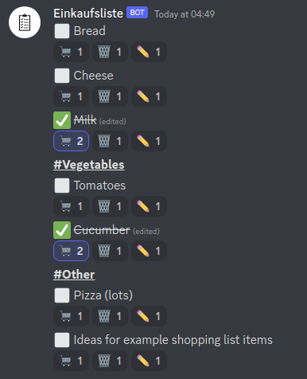

# Einkaufsliste
A simple shopping list bot for discord written in go

## Usage
### Setup
In a dedicated channel, run `!trackchannel` or `!addchannel` (assuming default prefix `!`) to start tracking items in this channel.
Use `!untrackchannel` or `!removechannel` to undo this again.

### Behaviour
The Bot will take every message you type in tracked channels, repeat them line by line, and add reaction buttons for striking, deleting, and editing the items.
Messages starting with `#` will be ignored. In messages with multiple items, lines starting with `#` will not be treated as items but repeated bold and underlined to act as a separator or note.
To edit items, react with the pencil icon, and send a message with the text to replace the item. Remove the reaction again to cancel.

## Running
This bot is made with go, so you need to install the `go` toolchain to compile it.

Create an application and bot account in the discord developer portal.
You need the "message content intent" so enable that.

Put the bot account token in a file called `token.secret` (Without the `Bot ` prefix).

Then simply execute `run.sh` to run the bot and append output to a log file.
